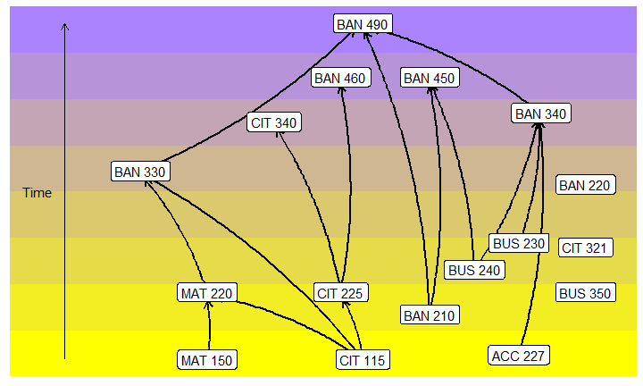

# Business Analytics
Matt Rissler  
`r format(Sys.Date())`  

## The Major

<!-- -->

## All? the Worst Cases
<!-- -->

## Rotation of Classes

If a class does not appear, it is offered every semester.

Code      Title                Semester     
--------  -------------------  -------------
CIT 321   Data Analysis        Springs      
CIT 340   Machine Learning     Even Springs 
MAT 220   Prob/Stats           Springs      
BAN 220   Data Visualization   Springs      

## Rotation of Classes

Code      Title                   Semester    
--------  ----------------------  ------------
BAN 330   Intro to Data Science   Odd Falls   
BAN 340   Innovation              Springs     
BAN 450   Marketing Analytics     Falls       
BAN 460   Big Data Analytics      Odd Springs 
BAN 490   Discovery               Springs     
